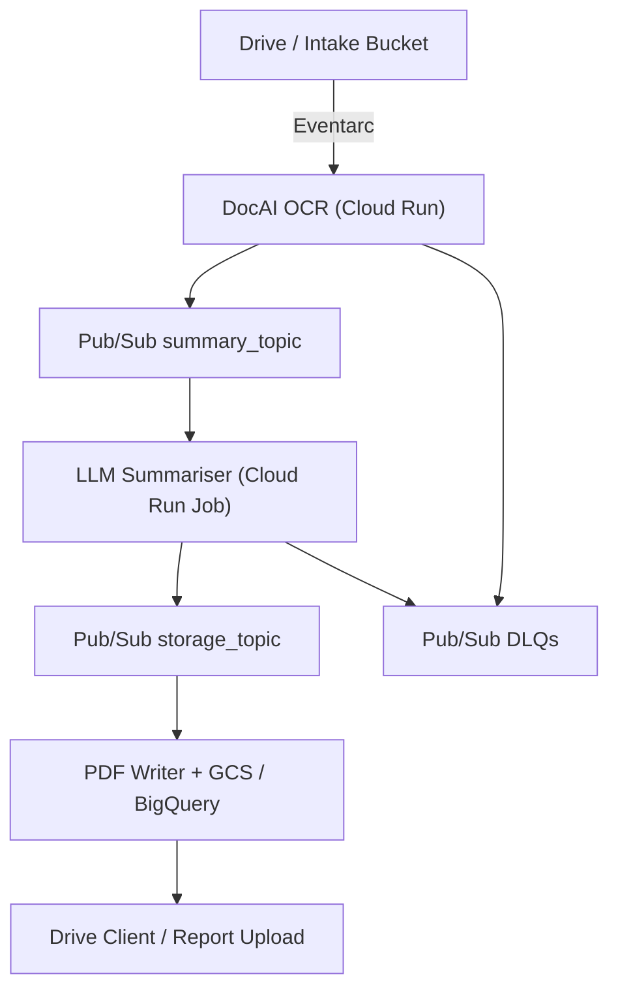

# MCC OCR Summary · Quick Start

This guide walks through local development, stubbed testing, and deployment for the MCC OCR → Summarisation service.

## Architecture at a Glance



## Prerequisites

- Python 3.11+
- Docker (for reproducible builds)
- `gcloud` CLI authenticated against the target project
- Access to Google Secret Manager (for OpenAI key, internal event token, service account JSON)

## 1. Clone & Bootstrap

```bash
git clone https://github.com/MJDinero/MCC-OCR-Summary.git
cd MCC-OCR-Summary
cp .env.template .env.mcc
```

Update `.env.mcc` with your project details (bucket names, Document AI processor IDs, Secret Manager URIs, etc.).

Install dependencies:

```bash
make install
```

## 2. Provision IAM + Secrets

1. Run the least-privilege bootstrapper (requires env vars for buckets/dataset):

   ```bash
   PROJECT_ID=<project> REGION=us-central1 \
   INTAKE_BUCKET=<intake-bucket> OUTPUT_BUCKET=<output-bucket> \
   SUMMARY_BUCKET=<summary-bucket> STATE_BUCKET=<state-bucket> \
   SUMMARY_BIGQUERY_DATASET=<dataset> ./infra/iam.sh
   ```

2. Store sensitive material in Secret Manager:

   ```bash
   gcloud secrets versions add OPENAI_API_KEY --data-file openai.key
   gcloud secrets versions add INTERNAL_EVENT_TOKEN --data-file token.txt
   gcloud secrets versions add mcc_orch_sa_key --data-file mcc_orch_sa_key.json
   ```

3. Reference those secrets via `sm://` URIs in your `.env.mcc`.

## 3. Local Run (Stub Mode)

1. Enable stubbed services to avoid hitting DocAI / OpenAI:

   ```bash
   export STUB_MODE=true
   ```

2. Start the API:

   ```bash
   make run-local
   ```

3. Smoke test:

   ```bash
   curl -s http://127.0.0.1:8080/healthz
   ```

Use `scripts/smoke_test.py` for a fuller workflow once DocAI credentials are wired.

### Offline test suite

Run unit tests with service stubs (DocAI + Drive) via:

```bash
make test-local
```

This sets `PYTEST_USE_STUBS=1` so tests replace Google clients with the lightweight stubs in `tests/stubs/`.

### Drive intake tips

- When inspecting the intake folder, exclude generated summaries to avoid re-processing outputs:

  ```bash
  ACCESS_TOKEN="$(gcloud auth print-access-token)"
  curl -s -G \
    -H "Authorization: Bearer ${ACCESS_TOKEN}" \
    "https://www.googleapis.com/drive/v3/files" \
    --data-urlencode "q=mimeType='application/pdf' and trashed=false and not name contains 'summary'" \
    --data-urlencode "pageSize=5" \
    --data-urlencode "fields=files(id,name,modifiedTime)"
  ```

- Keep a known-good source document ID handy (e.g. `SOURCE_FILE_ID=1ZFra9EN0jS8wTS4dcW7deypxnVggb8vS`) for repeatable verification runs.

## 4. Tests & CI Locally

- Unit + lint/type checks: `make ci-local`
- Individual suites: `make test`, `make lint`, `make type`

CI (GitHub Actions) runs the same gates plus Bandit, pip-audit, detect-secrets, and TruffleHog.

## 5. Reproducible Build

```bash
make build
docker run --rm -p 8080:8080 --env-file .env.mcc $(REGION)-docker.pkg.dev/$(PROJECT_ID)/$(AR_REPO)/$(SERVICE):$(shell git rev-parse --short HEAD)
```

The Dockerfile pins `python:3.11.7-slim` for deterministic layers.

## 6. Deploy & Validate

1. Submit via Cloud Build:

   ```bash
   gcloud builds submit --config cloudbuild.yaml \
     --substitutions=_PROJECT=$PROJECT_ID,_REGION=$REGION
   ```

2. After Cloud Run updates, verify:

   ```bash
   SERVICE_URL=$(gcloud run services describe mcc-ocr-summary --region $REGION --format='value(status.url)')
   curl -s "${SERVICE_URL}/healthz"
   ```

3. Trigger an end-to-end smoke test:

   ```bash
   python scripts/smoke_test.py --service-url "${SERVICE_URL}"
   ```

### Final verification runner (real document)

Run the tolerant validator against the 263-page fixture (or a freshly listed file) from your workstation or a build agent. The snippet below is `zsh`-safe and ensures quota headers plus optional Drive `resourceKey` handling:

```bash
PROJECT_ID="${PROJECT_ID:-quantify-agent}"
RUN_URL="${RUN_URL:-https://mcc-ocr-summary-6vupjpy5la-uc.a.run.app}"
SOURCE_FILE_ID="${SOURCE_FILE_ID:-1ZFra9EN0jS8wTS4dcW7deypxnVggb8vS}"
bash <<'BASH'
set -euo pipefail
TOKEN="$(gcloud auth print-identity-token)"
AT_ADC="$(gcloud auth application-default print-access-token)"
PROJECT_ID="${PROJECT_ID:-quantify-agent}"
RUN_URL="${RUN_URL:?RUN_URL missing}"
SOURCE_FILE_ID="${SOURCE_FILE_ID:?SOURCE_FILE_ID missing}"

# Kick off drive processing
curl -fsS -G "${RUN_URL}/process/drive" \
  -H "Authorization: Bearer ${TOKEN}" \
  --data-urlencode "file_id=${SOURCE_FILE_ID}" \
  -H "Accept: application/json" \
  -o /tmp/mcc_run.json
jq '{supervisor_passed, report_file_id, status, duration_ms:(.duration_ms // .meta.duration_ms)}' /tmp/mcc_run.json

RID="$(jq -r '.report_file_id // empty' /tmp/mcc_run.json)"
if [[ -z "${RID}" ]]; then
  echo "✗ No report_file_id returned" >&2
  exit 3
fi

# Fetch metadata to discover resource keys (shared-drive / restricted files)
curl -fsS -G "https://www.googleapis.com/drive/v3/files/${RID}" \
  -H "Authorization: Bearer ${AT_ADC}" \
  -H "X-Goog-User-Project: ${PROJECT_ID}" \
  --data-urlencode "fields=id,name,resourceKey" \
  -o /tmp/mcc_meta.json
RESOURCE_KEY="$(jq -r '.resourceKey // empty' /tmp/mcc_meta.json)"

DOWNLOAD_URL="https://www.googleapis.com/drive/v3/files/${RID}?alt=media&supportsAllDrives=true"
if [[ -n "${RESOURCE_KEY}" ]]; then
  DOWNLOAD_URL="${DOWNLOAD_URL}&resourceKey=${RESOURCE_KEY}"
fi

curl -fsSL "${DOWNLOAD_URL}" \
  -H "Authorization: Bearer ${AT_ADC}" \
  -H "X-Goog-User-Project: ${PROJECT_ID}" \
  -o /tmp/summary.pdf

pdftotext -layout -nopgbrk /tmp/summary.pdf /tmp/summary.txt
LEN=$(wc -m < /tmp/summary.txt | tr -d ' ')
h1=$(grep -qiE '^\s*Intro\s+Overview\b' /tmp/summary.txt && echo true || echo false)
h2=$(grep -qiE '^\s*Key\s+Points\b' /tmp/summary.txt && echo true || echo false)
h3=$(grep -qiE '^\s*Detailed\s+Findings\b' /tmp/summary.txt && echo true || echo false)
h4=$(grep -qiE '^\s*Care\s+Plan.*(and|&).*(Follow.?Up)\b' /tmp/summary.txt && echo true || echo false)
noise=$([[ ! $(egrep -qi '(FAX|Page[[:space:]]+[0-9]+[[:space:]]+of|CPT|ICD|invoice|charges|ledger|affidavit|notary|follow[[:space:]]+.*instructions|call[[:space:]]+911)' /tmp/summary.txt) ]] && echo false || echo true)
secs=$([[ "${h1}${h2}${h3}${h4}" == "truetruetruetrue" ]] && echo true || echo false)
ok=$([[ "${noise}" == false && "${secs}" == true && ${LEN} -ge 500 ]] && echo true || echo false)
printf '\n{"length":%s,"sections_ok":%s,"noise_found":%s,"ok":%s}\n' "$LEN" "$secs" "$noise" "$ok"
BASH
```

Append the validator JSON, request/reply metadata, and the Drive report ID to `docs/audit/HARDENING_LOG.md`.

### Metrics snapshot

Capture the Prometheus metrics immediately after the verification run so the audit log can track regression signals:

```bash
curl -fsS "${RUN_URL}/metrics" | rg 'summariser_(chunks_total|chunk_chars|fallback_runs_total|needs_review_total|collapse_runs_total)'
```

Record the values (and the commit SHA / revision label) in `docs/audit/HARDENING_LOG.md`.

## Troubleshooting

| Symptom | Fix |
| ------- | ---- |
| `google-cloud-secret-manager` import errors | Run `make install` inside a fresh virtualenv; ensure `.venv` is activated. |
| `INTERNAL_EVENT_TOKEN must be configured` | Point the env var at `sm://internal-event-token` or set a placeholder for local stub runs. |
| DocAI quota errors during local tests | Export `STUB_MODE=true` (or set in `.env.mcc`) to bypass DocAI/OpenAI. |
| Cloud Run 500s | Check Cloud Logging for `unhandled_http_exception`; the FastAPI middleware now logs request path + trace id. |

Refer to `README.md` for architecture details and `docs/audit/HARDENING_LOG.md` for the complete remediation history.

## Compliance & Cost Guidance

- Ensure CMEK is enabled for all buckets/datasets (see `pipeline.yaml`).
- Run `infra/iam.sh` to regenerate least-privilege service accounts when adding environments.
- Weekly GitHub Actions “Weekly Security Scan” enforces pip-audit, detect-secrets, and TruffleHog.
- For retention/BAA requirements and DocAI/OpenAI cost levers, see `docs/COMPLIANCE_COST.md`.
